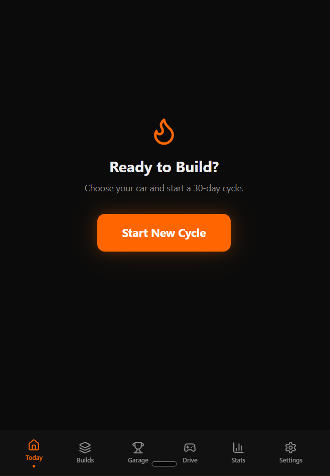
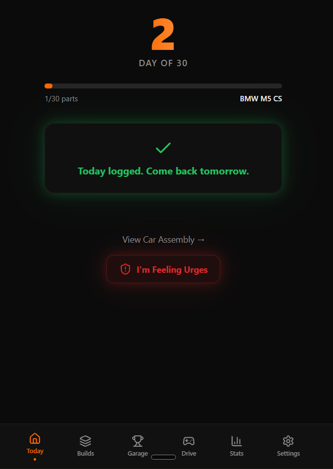
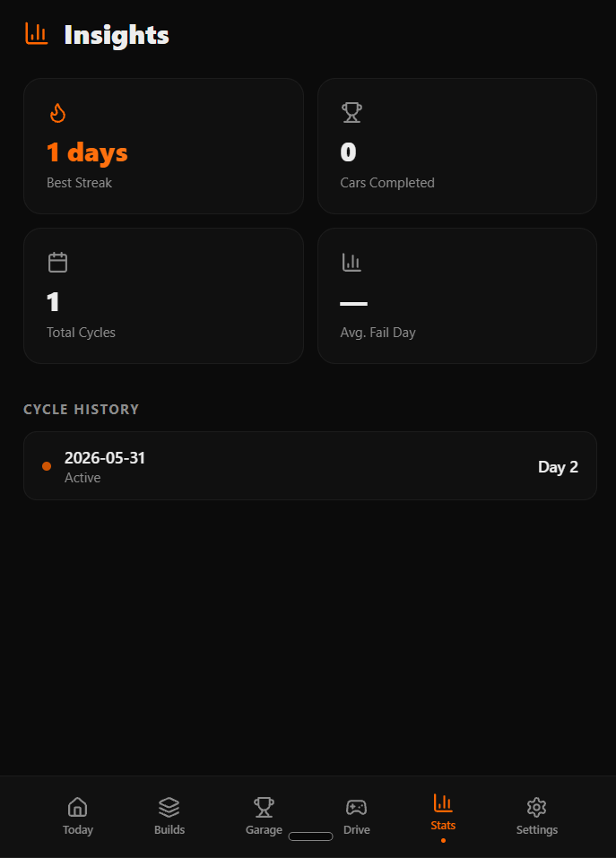

# nofapstreaker

**A focused streak-tracking app for building discipline, consistency, and self-control.**

nofapstreaker is an open-source app built to help users track their streaks, stay accountable, and maintain momentum through a simple, distraction-free interface.

---

## ✨ What it does

- Tracks streaks clearly and consistently
- Helps users monitor progress over time
- Keeps the experience minimal, clean, and easy to use
- Supports a self-improvement workflow without unnecessary clutter

---

## 📸 Preview

<table>
  <tr>
    <th>Home</th>
    <th>Daily Progress</th>
    <th>Stats</th>
  </tr>
  <tr>
    <td>
      
    </td>
    <td>
      
    </td>
    <td>
      
    </td>
  </tr>
</table>

---

## 🚀 Features

- **Streak tracking** — record and monitor your progress
- **Progress visibility** — see how far you have come
- **Simple UI** — no bloated distractions
- **Open source** — fully transparent and editable
- **Built for consistency** — designed around daily habit reinforcement

---
## 📲 Download APK

<p align="center">
  <a href="(https://github.com/vasantdesai212-dotcom/nofapstreaker-fc92683d/releases/download/v1.0.0/nofapstreaker.apk)">
    
  </a>
</p>

---

## 📦 Installation

```bash
git clone https://github.com/<your-username>/nofapstreaker.git
cd nofapstreaker
npm install
npm run dev

